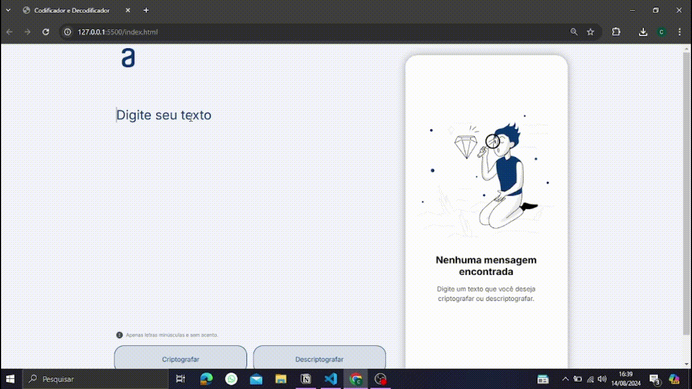

<h1>Bem vindos ao meu Decodificador de texto da Alura</h1>

## Descrição

Este projeto é um decodificador de texto que permite que os usuários insiram um texto para ser criptografado e descriptografar.

Este desafio foi proposto pela Alura, colocando em prática o que aprendi na trilha ONE. Confesso que foi desafiador mas pude contar com a ajuda de meus colegas, tornando a resolução do desafio possivel.

## Tecnologias Utilizadas

  

## Funcionalidade

Digite um texto qualquer na área `Digite seu texto` usando letras minúsculas e sem acento, depois clique no botão `Criptografar` para ter o seu texto criptografado.

Use o botão `Copiar` para copiar o texto criptografado e cole na área onde você digitou o texto.

Agora é só clicar no botão `Descriptografar` para ver o texto descriptografado.

## Em funcionamento

  

###

### Link da aplicação

<a href="https://decodificador-de-texto-ashy.vercel.app/" target="_blank"><strong>Decodificador de texto</strong></a>
